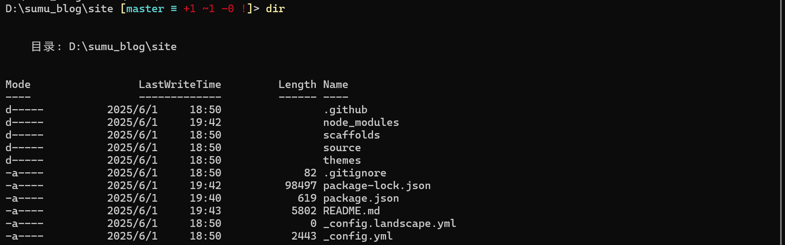
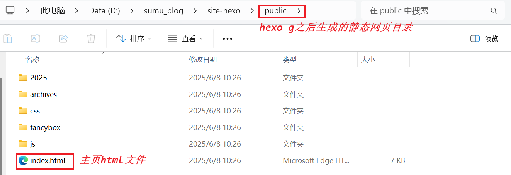
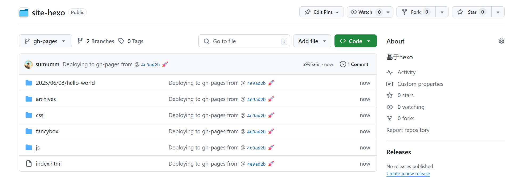
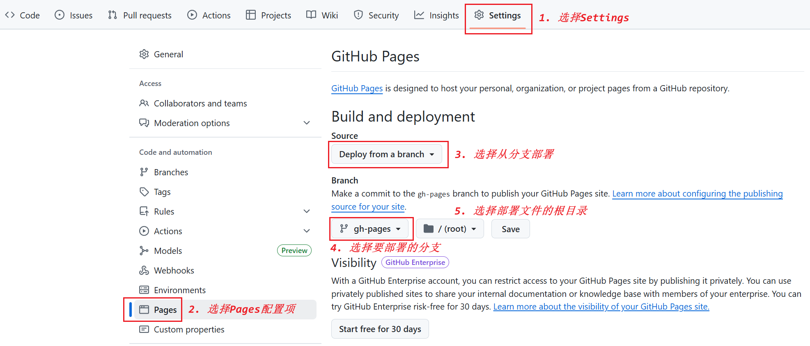
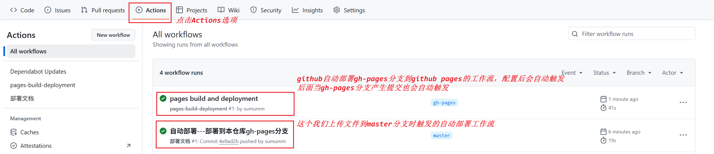
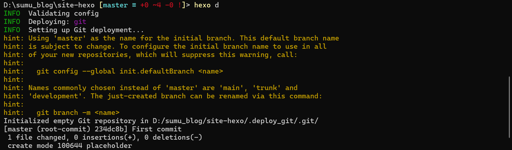
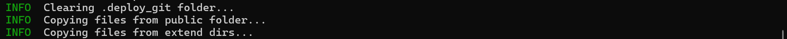
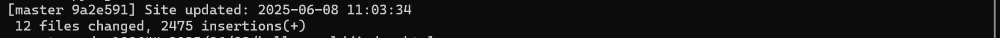
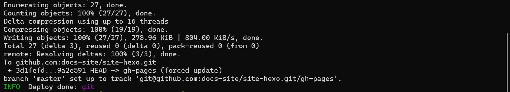
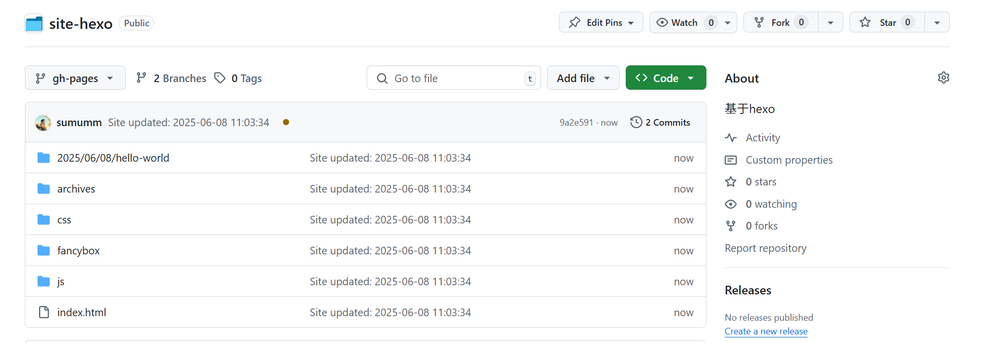

## <font size=3>一、site-hexo</font>

### <font size=3>1. 开发环境</font>

[](https://sumumm.github.io/)&nbsp;&nbsp;&nbsp;&nbsp;[](https://github.com/sumumm)&nbsp;&nbsp;&nbsp;&nbsp;[](https://www.npmjs.com/~sumumm)

[](https://nodejs.org/dist/v22.16.0/node-v22.16.0-win-x64.zip)&nbsp;&nbsp;&nbsp;&nbsp;[](https://badgen.net/static/npm/10.9.2/F96854)&nbsp;&nbsp;&nbsp;&nbsp;[](https://github.com/hexojs/hexo/releases/tag/v7.3.0)

### <font size=3>2. 建立site</font>

#### <font size=3>2.1 hexo-cli</font>

```shell
npm install hexo-cli -g # 全局安装hexo
hexo -v
```

#### <font size=3>2.2 初始化site</font>

```shell
hexo init <folder>
cd <folder>
npm install
```



#### <font size=3>2.3 本地预览</font>

```shell
hexo g # hexo generate 生成静态文件
hexo s # hexo server 启动服务器。 默认情况下，访问网址为： http://localhost:4000/。
```

## <font size=3>二、hexo命令</font>

### <font size=3>1. [hexo init](https://hexo.io/zh-cn/docs/commands#init)</font>

```shell
$ hexo init [folder]
```

新建一个网站。 如果没有设置 `folder` ，Hexo 默认在目前的文件夹建立网站。这个命令相当于执行了以下几步：

- （1）Git clone [hexo-starter](https://github.com/hexojs/hexo-starter) 和 [hexo-theme-landscape](https://github.com/hexojs/hexo-theme-landscape) 主题到当前目录或指定目录。

- （2）使用 [Yarn 1](https://classic.yarnpkg.com/lang/en/)、[pnpm](https://pnpm.io/zh/) 或 [npm](https://docs.npmjs.com/cli/install) 包管理器下载依赖（如有已安装多个，则列在前面的优先）。 npm 默认随 [Node.js](https://hexo.io/zh-cn/docs/index.html#安装-Node-js) 安装。

### <font size=3>2. [hexo new](https://hexo.io/zh-cn/docs/commands#new)</font>

```shell
$ hexo new [layout] <title>
```

新建一篇文章。 如果没有设置 `layout` 的话，默认使用 [_config.yml](https://hexo.io/zh-cn/docs/configuration) 中的 `default_layout` 参数代替。 使用布局 `draft` 来创建草稿。 如果标题包含空格的话，请使用引号括起来。

### <font size=3>3. [hexo generate](https://hexo.io/zh-cn/docs/commands#generate)</font>

```shell
$ hexo generate
```

生成静态文件。

### <font size=3>4. [hexo server](https://hexo.io/zh-cn/docs/commands#server)</font>

```shell
$ hexo server
```

启动服务器。 默认情况下，访问网址为： `http://localhost:4000/`。

### <font size=3>5. [hexo clean](https://hexo.io/zh-cn/docs/commands#clean)</font>

```shell
$ hexo clean
```

清除缓存文件 (`db.json`) 和已生成的静态文件 (`public`)。

## <font size=3>三、部署site</font>

### <font size=3>1. [JamesIves/github-pages-deploy-action](https://github.com/JamesIves/github-pages-deploy-action)</font>

先来认识一个github的action：[JamesIves/github-pages-deploy-action](https://github.com/JamesIves/github-pages-deploy-action)，使用这个 Action 可以将代码推送到我们想要的任何分支中，包括 gh-pages 和 docs, 甚至可以处理跨存储库部署。我们可以参考说明文档：[github-pages-deploy-action/README.md](https://github.com/JamesIves/github-pages-deploy-action/blob/dev/README.md)

#### <font size=3>1.1 重要配置</font>

- branch：此项必填，填入我们希望部署到的分支，例如 gh-pages 或 docs

- folder：此项必填，填入存储库中要部署的文件夹。此项自动识别为相对路径。如果构建输出到 dist 目录，可以直接设置 `dist`。如果希望部署根目录，可以设置 `.`。如果希望使用绝对路径访问 workflow 所在的 server，可以在路径前添加 `~`。

#### <font size=3>1.2 可选配置</font>

- token：此选项默认为可访问存储库的 Token。如果需要更多权限 (例如，部署到另一个存储库) ，可以通过此选项设置个人访问令牌 (PAT) 。本选项的值应该存储在仓库的 secrets 中。

- ssh-key：此选项可以填入部署用的 SSH 专用密钥，(选项的值应该存储在 secrets 中)，也可以将其设置为 `true` 使用现有的 SSH 客户端配置，使用 SSH 部署。

- repository-name：允许指定其他存储库路径，只要我们有权将其推送。格式应为: `用户名/存储库名称`。我们需要设置 token 为 PAT，此配置选项才能正常运行。

- target-folder：如果要将部署文件夹的内容推送到部署分支上的特定目录中，可以在此处指定。

- commit-message：定制提交信息

- clean：如果我们的项目在构建时生成哈希文件，则可以使用此选项在每次部署时从部署分支的目标文件夹中自动将其删除。此选项默认情况下处于启用状态，可以通过将其设置为来关闭 `false`。（也就是每次部署默认是全新的，不会保留任何上一次部署的文件。我们需要保证部署时您已经拥有了所有需要的文件。）

- clean-exclude：如果我们需要使用 `clean` 但想保留某些文件或文件夹，则可以使用此选项。这应该在多行字符串中将每个模式包含为一行。

- single-commit：如果我们希望在部署分支只有一次最新的提交，而不是维护完整的历史记录，则可以将此选项切换为 `true`。注意，使用此选项还将导致从部署分支中移除所有现有历史记录。

### <font size=3>2. 自动部署本仓库的Pages</font>

主要可以参考这里：[Configuring a publishing source for your GitHub Pages site - GitHub Docs](https://docs.github.com/en/pages/getting-started-with-github-pages/configuring-a-publishing-source-for-your-github-pages-site)。

> 这个好像是后来新加的功能，之前是要创建`https://github.com/<user_name>/<user_name>.github.io`，这样我们就不需要专门创建<user_name>.github.io了。

#### <font size=3>2.1 静态文件</font>

我们`hexo g`之后，静态网页的目录为`hexo-site/public`：



我们需要把这个public目录的内容部署到Github Pages中，可以通过GitHub Actions拉取仓库源码分支，安装node和hexo，通过hexo生成静态资源文件，然后使用[JamesIves/github-pages-deploy-action](https://github.com/JamesIves/github-pages-deploy-action)将这个public目录的内容发布到本仓库的一个分支`gh-pages`，就类似这样：



#### <font size=3>2.2 工作流文件</font>

可以直接看这里：[site-hexo/.github/workflows/deploy-docs.yml at master · docs-site/site-hexo](https://github.com/docs-site/site-hexo/blob/master/.github/workflows/deploy-docs.yml)

#### <font size=3>2.3 配置仓库Pages</font>

我们打开仓库【settings】&rarr;【Pages】：



#### <font size=3>2.4 触发的工作流</font>

会触发两个工作流，一个是我们自己的，一个是部署的时候自动产生的：



#### <font size=3>2.4 `_config.yml`</font>

上面部署完后，会发现访问 [https://docs-site.github.io/site-hexo/](https://docs-site.github.io/site-hexo/) 的时候页面出现错乱，主要是`hexo-site`配置文件有问题，我们需要修改url为站点的地址，否则找不到相关的资源：

```yaml
## Set your site url here. For example, if you use GitHub Page, set url as 'https://username.github.io/project'
url: https://docs-site.github.io/site-hexo/
```

### <font size=3>3. 手动部署其他仓库</font>

上面的方式虽然方便，但是有一点不好，那就是部署后要想访问，这个仓库需要是公开的，如果不想自己的笔记源码被别人看到，那么这种方式就不是很好了。其实由上面可以知道，我们只需要将生成的静态资源，也就是`hexo-site/public`下的资源上传到某个仓库的某个分支，然后配置Pages，就可以实现部署和访问。

hexo中提供了手动部署的方式，可以参考：[One-Command Deployment | Hexo](https://hexo.io/docs/one-command-deployment)，我们安装[hexojs/hexo-deployer-git](https://github.com/hexojs/hexo-deployer-git)插件：

```shell
npm install hexo-deployer-git --save
```

然后在`hexo-site/_config.yml`中配置：

```yaml
## Docs: https://hexo.io/docs/one-command-deployment
deploy:
  type: 'git'
  repo: 
    github: 'git@github.com:sumumm/site.git' # https://bitbucket.org/JohnSmith/johnsmith.bitbucket.io
    # gitee: 'git@gitee.com:sumumm/sumumm.git'
  branch: gh-pages
  message:

```

这里就可以自己指定github仓库和分支，想要部署到哪个仓库都可以，前提是我们要有权限向这个仓库push。这个时候我们配置仓库的Pages的时候就可以选择自己想要部署的分支了。配置完成后，我们执行以下命令：

```shell
cd hexo-site
hexo g
hexo d
```

会看到有如下打印信息：

- （1）初始化了一个.deploy_git 仓库，初始化的时候会进行一次提交



- （2）拷贝hexo-site/public中的文件到.deploy_git中。



- （3）提交所有文件



这里会有默认的提交信息。也是可以自定义的。

- （4）推送到远程分支



- （5）最后就可以自动部署到指定仓库的指定分支了：




## <font size=3>三、参考资料</font>

> - [Hexo](https://hexo.io/zh-cn/)

## <font size=3>四、小徽章</font>

>- [badgen.net](https://badgen.net/)
>- [Shields.io | Shields.io](https://shields.io/)
>- [For the Badge](https://forthebadge.com/)

